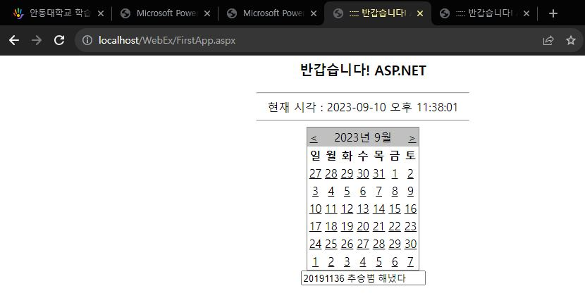

# 과제1
## 기본루트

## 가상루트


```
Web.comfig에 system.web내부에
<globalization fileEncoding="utf-8" requestEncoding="utf-8" responseEncoding="utf-8" culture="ko-KR" uiCulture="ko-KR"/>

넣어서 한글이 깨지지않게 실행 성공
```
