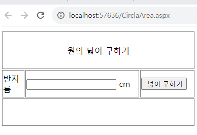
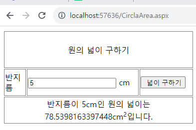

# 원의 원주율을 계산하는 ASP.Net기반의 웹페이지 만들기
## 결과



## 코드
``` c#
<%@ Page Language="C#" AutoEventWireup="true" CodeFile="CircleArea.aspx.cs" Inherits="CircleArea" %>

<!DOCTYPE html>

<html xmlns="http://www.w3.org/1999/xhtml">
<head runat="server">
<meta http-equiv="Content-Type" content="text/html; charset=utf-8"/>
    <title>원의 넓이를 구하는 웹 사이트</title>
    <style type="text/css">
        .auto-style2 {
            text-align: center;
        }
        .auto-style3 {
            width: 450px;
            height: 22px;
        }
        .auto-style4 {
            width: 42%;
        }
    </style>
</head>
<body>
    <form id="form1" runat="server">
        <div>
            <table class="auto-style4">
                <tr>
                    <td class="auto-style2" colspan="3" style="border: 1px solid #808080; border-collapse: collapse; height: 70px;">원의 넓이 구하기</td>
                </tr>
                <tr>
                    <td style="border: 1px solid #808080; border-collapse: collapse; height: 50px;">반지름</td>
                    <td style="border: 1px solid #808080; border-collapse: collapse">
                        <asp:TextBox ID="txtRadius" runat="server"></asp:TextBox>
                        cm</td>
                    <td style="border: 1px solid #808080; border-collapse: collapse">
                        <asp:Button ID="btnArea" runat="server" Text=" 넓이 구하기" OnClick="btnArea_Click" />
                    </td>
                </tr>
                <tr>
                    <td class="auto-style3" colspan="3" style="border: 1px solid #808080; border-collapse: collapse; text-align: center; height: 50px;">
                        <asp:Label ID="lblOutput" runat="server"></asp:Label>
                    </td>
                </tr>
            </table>
        </div>
    </form>
</body>
</html>
```

``` c#
using System;
using System.Collections.Generic;
using System.Linq;
using System.Web;
using System.Web.UI;
using System.Web.UI.WebControls;

public partial class CircleArea : System.Web.UI.Page
{
    protected void Page_Load(object sender, EventArgs e){}
    protected void btnArea_Click(object sender, EventArgs e)
    {
        double dRadius = double.Parse(txtRadius.Text);
        double dArea = dRadius * dRadius * Math.PI;
        lblOutput.Text = "반지름이 " + txtRadius.Text + "cm인 원의 넓이는 " +
        dArea.ToString() + "cm<sup>2</sup>입니다.";
    }
}
```
