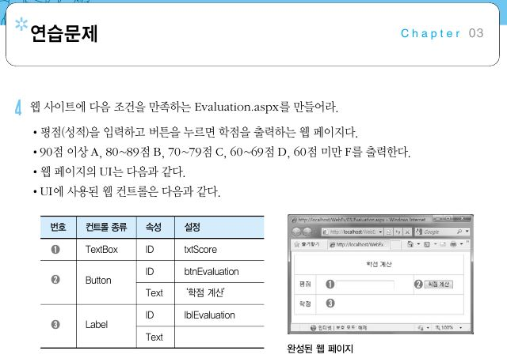
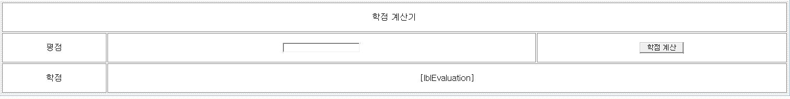
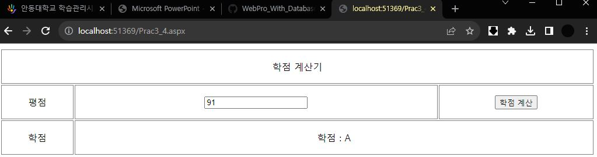
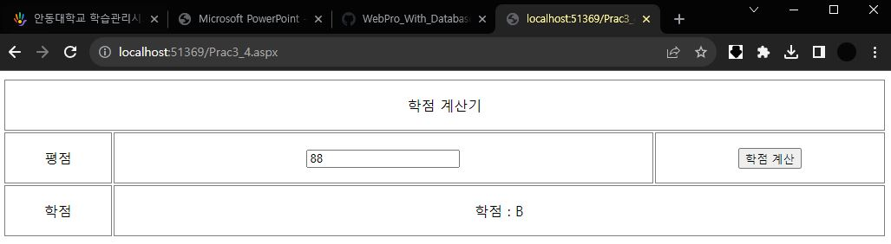
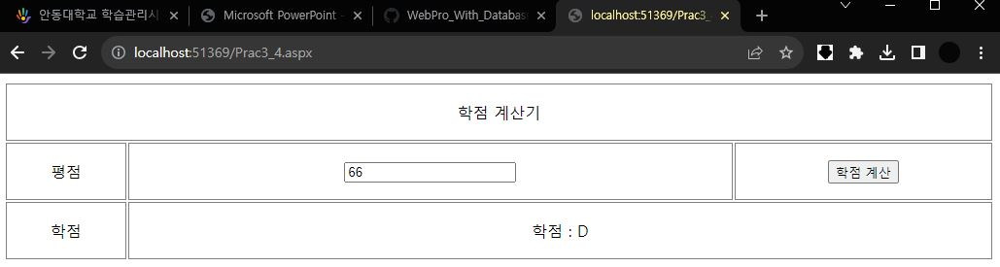
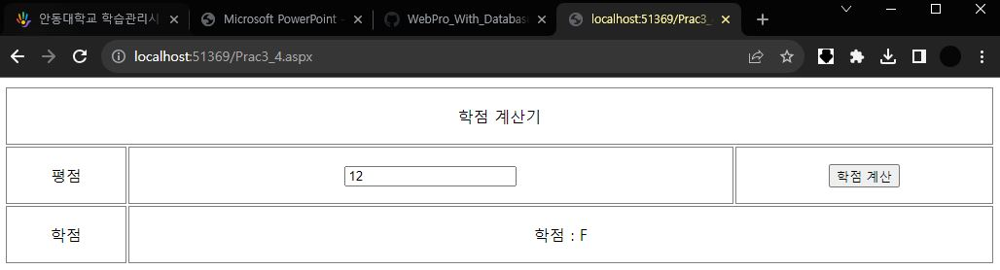

# 3장 연습문제4

## 디자인

## 코드
* HTML코드
```html
<%@ Page Language="C#" AutoEventWireup="true" CodeFile="Prac3_4.aspx.cs" Inherits="Prac3_4" %>

<!DOCTYPE html>

<html xmlns="http://www.w3.org/1999/xhtml">
<head runat="server">
<meta http-equiv="Content-Type" content="text/html; charset=utf-8"/>
    <title></title>
</head>
<body>
    <form id="form1" runat="server">
        <div>
            <table style="width:100%;">
                <tr>
                    <td colspan="3" style="border: 1px solid #808080; text-align: center; border-collapse: collapse; height: 55px;">학점 계산기</td>
                </tr>
                <tr>
                    <td style="border: 1px solid #808080; text-align: center; border-collapse: collapse; height: 55px;">평점</td>
                    <td style="border: 1px solid #808080; text-align: center; border-collapse: collapse; height: 55px;">
                        <asp:TextBox ID="txtScore" runat="server"></asp:TextBox>
                    </td>
                    <td style="border: 1px solid #808080; text-align: center; border-collapse: collapse; height: 55px;">
                        <asp:Button ID="btnEvaluation" runat="server" OnClick="btnEvaluation_Click" Text="학점 계산" />
                    </td>
                </tr>
                <tr>
                    <td style="border: 1px solid #808080; text-align: center; border-collapse: collapse; height: 55px;">학점</td>
                    <td colspan="2" style="border: 1px solid #808080; text-align: center; border-collapse: collapse; height: 55px;">
                        <asp:Label ID="lblEvaluation" runat="server"></asp:Label>
                    </td>
                </tr>
            </table>
        </div>
    </form>
</body>
</html>
```
* C#코드
```c#
using System;
using System.Collections.Generic;
using System.Linq;
using System.Web;
using System.Web.UI;
using System.Web.UI.WebControls;

public partial class Prac3_4 : System.Web.UI.Page
{
    protected void Page_Load(object sender, EventArgs e){}
    protected void btnEvaluation_Click(object sender, EventArgs e)
    {
        double dScore = double.Parse(txtScore.Text);
        if(dScore >= 90) { lblEvaluation.Text = "학점 : A"; }
        else if (dScore >= 80) { lblEvaluation.Text = "학점 : B"; }
        else if (dScore >= 70) { lblEvaluation.Text = "학점 : C"; }
        else if (dScore >= 60) { lblEvaluation.Text = "학점 : D"; }
        else { lblEvaluation.Text = "학점 : F"; }
    }
}
```
## 결과








