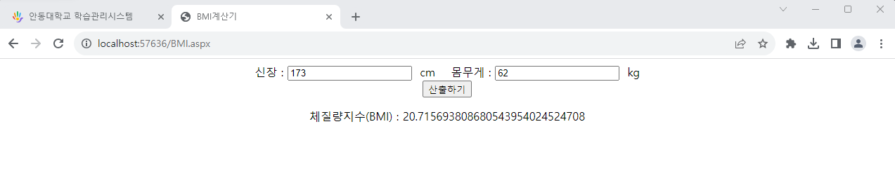
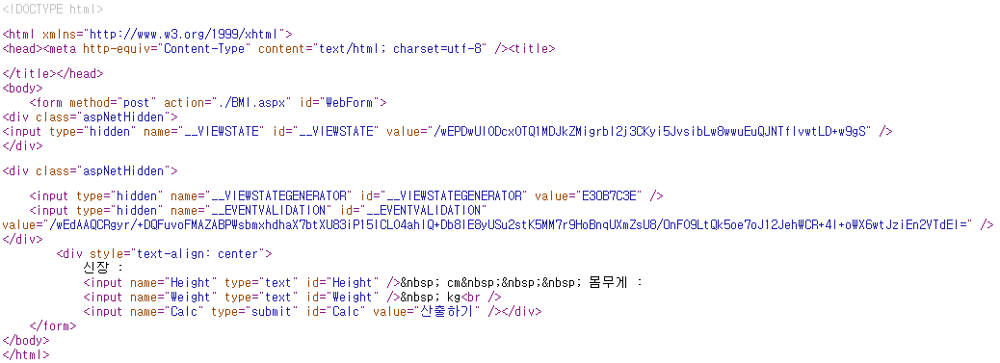

# 실습 4-1, 4-2
## 결과 화면





## 코드
```html
<%@ Page Language="C#" AutoEventWireup="true" CodeFile="BMI.aspx.cs" Inherits="BMI" %>

<!DOCTYPE html>

<html xmlns="http://www.w3.org/1999/xhtml">
<head runat="server">
<meta http-equiv="Content-Type" content="text/html; charset=utf-8"/>
    <title>BMI계산기</title>
</head>
<body>
    <form id="WebForm" runat="server">
        <div style="text-align: center">
            신장 :
            <input id="Height" type="text" runat="server"/>&nbsp; cm&nbsp;&nbsp;&nbsp; 몸무게 :
            <input id="Weight" type="text" runat="server"/>&nbsp; kg<br />
            <input id="Calc" type="submit" value="산출하기" OnServerClick="Calc_ServerClick" runat="server"/><br />
            <p id ="Result" runat="server"></p>
        </div>
    </form>
</body>
</html>
```

```c#
using System;
using System.Collections.Generic;
using System.Linq;
using System.Web;
using System.Web.UI;
using System.Web.UI.WebControls;

public partial class BMI : System.Web.UI.Page
{
    protected void Page_Load(object sender, EventArgs e)
    {

    }
    protected void Calc_ServerClick(object sender, EventArgs e)
    {
        decimal height = Decimal.Parse(Height.Value) / 100;
        decimal weight = Decimal.Parse(Weight.Value);
        decimal BMI = weight / (height * height);
        Result.InnerText = "체질량지수(BMI) : " + BMI.ToString();
    }
}
```
