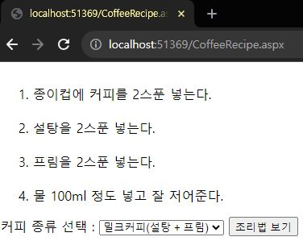
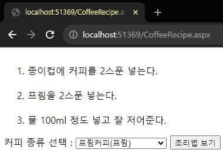
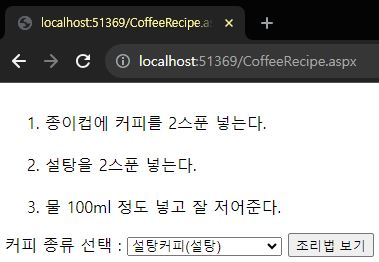
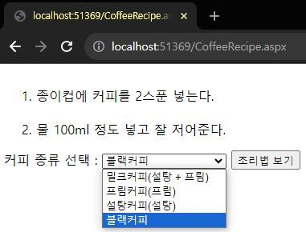
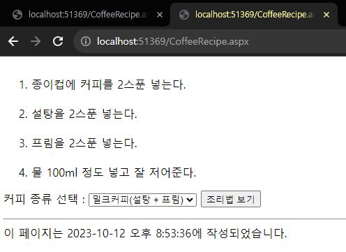

# 실습 4-4, 4-5
## 실습 4-4 CoffeeRecipe 출력하기
```html
<%@ Page Language="C#" AutoEventWireup="true" CodeFile="CoffeeRecipe.aspx.cs" Inherits="CoffeeRecipe" %>

<!DOCTYPE html>

<html xmlns="http://www.w3.org/1999/xhtml">
<head runat="server">
<meta http-equiv="Content-Type" content="text/html; charset=utf-8"/>
    <title></title>
</head>
<body>
    <form id="CoffeeForm" runat="server">
        <div>
            커피 종류 선택 :
            <select id="CoffeeType" name="D1" runat="server">
                <option></option>
            </select>
            <input id="ShowRecipe" type="submit" value="조리법 보기" OnServerClick ="Show_ServerClick" runat="server" /></div>
    </form>
</body>
</html>
```

```c#
using System;
using System.Collections.Generic;
using System.Linq;
using System.Web;
using System.Web.UI;
using System.Web.UI.WebControls;

public partial class CoffeeRecipe : System.Web.UI.Page
{
    protected void Page_Load(object sender, EventArgs e)
    {
        if (!IsPostBack)
        {
            CoffeeType.Items.Clear();
            CoffeeType.Items.Add(new ListItem("밀크커피(설탕 + 프림)", "0"));
            CoffeeType.Items.Add(new ListItem("프림커피(프림)", "1"));
            CoffeeType.Items.Add(new ListItem("설탕커피(설탕)", "2"));
            CoffeeType.Items.Add(new ListItem("블랙커피", "3"));
        }
    }
    protected void Show_ServerClick(object sender, EventArgs e)
    {
        string filePath = Request.PhysicalApplicationPath + @"App_Data\";
        string fileName = "";

        Response.Write("<ol>");

        ListItem item = CoffeeType.Items[CoffeeType.SelectedIndex];
        int coffeeType = int.Parse(item.Value);

        for (int i = 0; i < 4; i++)
        {
            fileName = filePath + i + ".txt";
            Response.WriteFile(fileName);

            if (i !=3 && ((i & coffeeType) == 1 || (i & coffeeType) == 2 )) Response.Clear();

            Response.Flush();
        }
        Response.Write("</ol>");
    }
}
```









---
---
## 실습 4-5 전역 애플리케이션 클래스 넣기
```c#
<%@ Application Language="C#" %>

<script runat="server">
    void Application_EndRequest(object sender, EventArgs e){
        Response.Write("<hr />");
        Response.Write("이 페이지는 ");
        Response.Write(DateTime.Now.ToString());
        Response.Write("에 작성되었습니다.");
    }  
</script>
```



