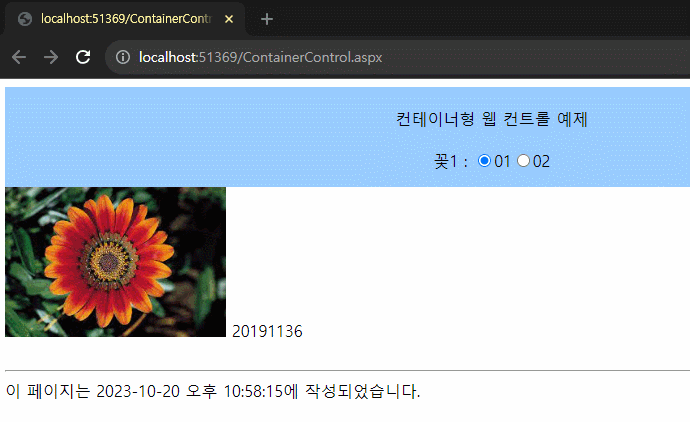

# 5-1 ~ 5-4
## 5-1 실습

```html
<%@ Page Language="C#" AutoEventWireup="true" CodeFile="ButtonControl.aspx.cs" Inherits="ButtonControl" %>

<html mlns="http://www.w3.org/1999/html">
<head runat="server">
<meta http-equiv="Content-Type" content="text/html; charset=utf-8"/>
    <title> 5-1 </title>
    <script type="text/javascript">
        function ConfirmGoHanbit() {
            return confirm("한빛미디어로 이동하시겠습니까?");
        }
    </script>
</head>
<body>
    <form id="form1" runat="server">
        <div style="text-align: center">
            <asp:Button ID="btnSortAscending" runat="server" Text="오름차순 정렬" CommandName ="Sort" CommandArgument ="Ascending" OnCommand="CommandBtn_Click" />
            <asp:Button ID="btnSortDescending" runat="server" Text="내림차순 정렬" CommandName ="Sort" CommandArgument ="Descending" OnCommand="CommandBtn_Click"/>
            <br />
            <br />
            <asp:LinkButton ID="lbtnGoHanbit" runat="server"
                onclientclick="return ConfirmGoHanbit()" onclick="GoHanbitBtn_Click" Text="Go! Hanbit Media, Inc."></asp:LinkButton>
            <br />
            <br />
            <asp:ImageButton ID="ibtnHanbit" runat="server" ImageUrl ="~/images/flower1.jpeg" OnClick="ibtnHanbit_Click1" />
            <br />
            <br />
            <asp:Label ID="lblMessage" runat="server" Text="Label"></asp:Label>
        </div>
    </form>
</body>
</html>

```
```c#
using System;
using System.Collections.Generic;
using System.Linq;
using System.Web;
using System.Web.UI;
using System.Web.UI.WebControls;

public partial class ButtonControl : System.Web.UI.Page
{
    protected void Page_Load(object sender, EventArgs e)
    {
        lblMessage.Text = "";
    }

    protected void CommandBtn_Click(object sender, CommandEventArgs e)
    {
        switch(e.CommandName)
        {
            case "Sort":
                Sort_List((String)e.CommandArgument);
                break;
            default:
                lblMessage.Text = "CommandName을 확인해주세요.";
                break;
        }
    }
    void Sort_List(String CommandArgument)
    {
        switch (CommandArgument)
        {
            case "Ascending":
                lblMessage.Text = "자료를 오름차순으로 정렬하였습니다.";
                break;
            case "Descending":
                lblMessage.Text = "자료를 내림차순으로 정렬하였습니다.";
                break;
            default:
                lblMessage.Text = "CommandArgument를 확인해주세요.";
                break;
        }
    }

    protected void ibtnHanbit_Click1(object sender, ImageClickEventArgs e)
    {
        lblMessage.Text = "그림 위 (" + e.X.ToString() + " , ";
        lblMessage.Text += e.Y.ToString() + ") (을)를 클릭하셨습니다.";
    }

    protected void GoHanbitBtn_Click(object sender, EventArgs e)
    {
        Response.Redirect("http://www.hanb.co.kr/");
    }
}
```

## 5-2 실습

```html
<%@ Page Language="C#" AutoEventWireup="true" CodeFile="ListControl.aspx.cs" Inherits="ListControl" %>

<!DOCTYPE html>

<html xmlns="http://www.w3.org/1999/xhtml">
<head runat="server">
<meta http-equiv="Content-Type" content="text/html; charset=utf-8"/>
    <title></title>
</head>
<body>
    <form id="form1" runat="server">
        <div>
            <asp:Label ID="lblTitle" runat="server" Text="목록형 컨트롤 사용 예제 20191136" Font-Size ="Large"></asp:Label>
            <br />
            <br />
            <asp:Label ID="lblRepeatDirection" runat="server" Text="RepeatDirection :"></asp:Label>
            <asp:RadioButtonList ID="rblRepeatDirection" runat="server" RepeatDirection="Horizontal" RepeatLayout="Flow" AutoPostBack ="true" OnSelectedIndexChanged="rbRepeatDirection_SelectedIndexChanged">
                <asp:ListItem Selected="True" Value="0">Horizontal</asp:ListItem>
                <asp:ListItem Value="1">Vertical</asp:ListItem>
            </asp:RadioButtonList>
            <br />
            <asp:Label ID="lblRepeatLayout" runat="server" Text="RepeatLayout :"></asp:Label>
            <asp:RadioButtonList ID="rblRepeatLayout" runat="server" RepeatDirection="Horizontal" RepeatLayout="Flow" AutoPostBack="true" OnSelectedIndexChanged="rbRepeatLayout_SelectedIndexChanged">
                <asp:ListItem Selected="True" Value="0">Table</asp:ListItem>
                <asp:ListItem Value="1">Flow</asp:ListItem>
            </asp:RadioButtonList>
            <br />
            <asp:Label ID="cblMyInterests" runat="server" Text="나의 관심 분야 선택"></asp:Label>
            <asp:CheckBoxList ID="cblInterests" runat="server" AutoPostBack="true" RepeatColumns="3" OnSelectedIndexChanged="cbInterests_SelectedIndexChanged">
                <asp:ListItem>문학</asp:ListItem>
                <asp:ListItem>경제/경영</asp:ListItem>
                <asp:ListItem>외국어</asp:ListItem>
                <asp:ListItem>예술</asp:ListItem>
                <asp:ListItem>자연과학</asp:ListItem>
                <asp:ListItem>취미/실용</asp:ListItem>
                <asp:ListItem>인문</asp:ListItem>
                <asp:ListItem>컴퓨터</asp:ListItem>
                <asp:ListItem>스포츠</asp:ListItem>
                <asp:ListItem>정치/사회</asp:ListItem>
            </asp:CheckBoxList>
            <br />
            <asp:Label ID="lblBulletStyle" runat="server" Text="DisplayMode :"></asp:Label>
            <asp:DropDownList ID="ddlBulletStyle" runat="server" AutoPostBack="true" OnSelectedIndexChanged="ddlBulletStyle_SelectedIndexChanged">
                <asp:ListItem Value="0">NotSet</asp:ListItem>
                <asp:ListItem Value="1">Numbered</asp:ListItem>
                <asp:ListItem Value="2">LowerAlpha</asp:ListItem>
                <asp:ListItem Value="3">UpperAlpha</asp:ListItem>
                <asp:ListItem Value="4">LowerRoman</asp:ListItem>
                <asp:ListItem Value="5">UpperRoman</asp:ListItem>
                <asp:ListItem Value="6">Disc</asp:ListItem>
                <asp:ListItem Value="7">Circle</asp:ListItem>
                <asp:ListItem Value="8">Square</asp:ListItem>
            </asp:DropDownList>
            <br />
            <br />
            <asp:Label ID="lblSelectedInterests" runat="server" Text="선택한 관심 분야 목록"></asp:Label>
            <asp:BulletedList ID="btlSelectedInterests" runat="server">
            </asp:BulletedList>
        </div>
    </form>
</body>
</html>
```
```c#
using System;
using System.Collections.Generic;
using System.Linq;
using System.Web;
using System.Web.UI;
using System.Web.UI.WebControls;

public partial class ListControl : System.Web.UI.Page
{
    protected void Page_Load(object sender, EventArgs e)
    {
    }

    protected void rbRepeatDirection_SelectedIndexChanged(object sender, EventArgs e)
    {
        cblInterests.RepeatDirection = (RepeatDirection)rblRepeatDirection.SelectedIndex;
    }

    protected void rbRepeatLayout_SelectedIndexChanged(object sender, EventArgs e)
    {
        cblInterests.RepeatLayout = (RepeatLayout)rblRepeatLayout.SelectedIndex;
    }

    protected void cbInterests_SelectedIndexChanged(object sender, EventArgs e)
    {
        btlSelectedInterests.Items.Clear();

        foreach(ListItem item in cblInterests.Items)
        {
            if(item.Selected) btlSelectedInterests.Items.Add(item); 
        }
    }

    protected void ddlBulletStyle_SelectedIndexChanged(object sender, EventArgs e)
    {
        btlSelectedInterests.BulletStyle = (BulletStyle)ddlBulletStyle.SelectedIndex;
    }
}
```

## 5-3 실습

```html
<%@ Page Language="C#" AutoEventWireup="true" CodeFile="ContainerControl.aspx.cs" Inherits="ContainerControl" %>

<!DOCTYPE html>

<html xmlns="http://www.w3.org/1999/xhtml">
<head runat="server">
<meta http-equiv="Content-Type" content="text/html; charset=utf-8"/>
    <title></title>
</head>
<body>
    <form id="form1" runat="server">
        <div>
            <asp:Panel ID="pnlDirection" runat="server" HorizontalAlign="Center" BackColor="#99CCFF">
            </asp:Panel>
            <asp:MultiView ID="mvAlbum" runat="server" ActiveViewIndex="0">
                <asp:View ID="vAdsBag_01" runat="server">
                    <asp:Image ID="imgAdsBag_01" Height="150" ImageUrl="~/images/flower2.jpeg" runat="server" style="text-align: center" />
                </asp:View>
                <asp:View ID="vAdsBag_02" runat="server">
                    <asp:Image ID="imgAdsBag_02" Height="150" ImageUrl="~/images/flower3.jpeg" runat="server" style="text-align: center" />
                </asp:View>
            </asp:MultiView>
            <br />
            <br />
        </div>
    </form>
</body>
</html>

```
```c#
using System;
using System.Collections.Generic;
using System.Linq;
using System.Web;
using System.Web.UI;
using System.Web.UI.WebControls;

public partial class ContainerControl : System.Web.UI.Page
{
    protected void Page_Load(object sender, EventArgs e)
    {
        pnlDirection.Height = 100;

        LiteralControl Title = new LiteralControl();
        Title.Text = "<br /> 컨테이너형 웹 컨트롤 예제<br /><br /> 꽃1 : ";

        pnlDirection.Controls.Add(Title);

        RadioButton optAB_01 = new RadioButton();
        optAB_01.Text = "01";
        optAB_01.Checked = true;
        optAB_01.GroupName = "Selection";
        optAB_01.AutoPostBack = true;
        pnlDirection.Controls.Add(optAB_01);
        optAB_01.CheckedChanged += new System.EventHandler(optAB_01_Checked);

        RadioButton optAB_02 = new RadioButton();
        optAB_02.Text = "02";
        optAB_02.GroupName = "Selection";
        optAB_02.AutoPostBack = true;
        pnlDirection.Controls.Add (optAB_02);
        optAB_02.CheckedChanged += new System.EventHandler(optAB_02_Checked);

        Label lblAB_01 = new Label();
        Label lblAB_02 = new Label();
        lblAB_01.Text = "20191136";
        lblAB_02.Text = "추승범";
        vAdsBag_01.Controls.Add(lblAB_01);
        vAdsBag_02.Controls.Add(lblAB_02);
    }

    protected void optAB_01_Checked(object sender, EventArgs e)
    {
        mvAlbum.ActiveViewIndex = 0;
    }
    protected void optAB_02_Checked(object sender, EventArgs e)
    {
        mvAlbum.ActiveViewIndex = 1;
    }

}
```

## 5-4 실습

```html
<%@ Page Language="C#" AutoEventWireup="true" CodeFile="AdRotateControl.aspx.cs" Inherits="AdRotateControl" %>

<!DOCTYPE html>

<html xmlns="http://www.w3.org/1999/xhtml">
<head runat="server">
<meta http-equiv="Content-Type" content="text/html; charset=utf-8"/>
    <title></title>
</head>
<body>
    <form id="form1" runat="server">
        <div>
            <asp:AdRotator ID="adrBooks" AdvertisementFile="~/App_Data/ad.xml" Target="blank" runat="server" />
        </div>
    </form>
</body>
</html>

```
```xml
<?xml version="1.0" encoding="utf-8" ?>
<Advertisements>
  <Ad>
    <ImageUrl>~/Images/CodeCraft.bmp</ImageUrl>
    <NavigateUrl>http://www.hanb.co.kr/book/look.html?isbn=978-89-7914-514-4</NavigateUrl>
    <Keyword>Programming</Keyword>
    <Impressions>30</Impressions>
  </Ad>
  <Ad>
    <ImageUrl>~/Images/ShortCoding.bmp</ImageUrl>
    <NavigateUrl>http://www.hanb.co.kr/book/look.html?isbn=978-89-7914-561-8</NavigateUrl>
    <Keyword>Programming</Keyword>
    <Impressions>80</Impressions>
  </Ad>
  <Ad>
    <ImageUrl>~/Images/WebDesign.bmp</ImageUrl>
    <NavigateUrl>http://www.hanb.co.kr/book/look.html?isbn=978-89-7914-735-3</NavigateUrl>
    <Keyword>Web</Keyword>
    <Impressions>60</Impressions>
  </Ad>
  <Ad>
    <ImageUrl>~/Images/WebSiteMeasurementHacks.bmp</ImageUrl>
    <NavigateUrl>http://www.hanb.co.kr/book/look.html?isbn=89-7914-444-X</NavigateUrl>
    <Keyword>Web</Keyword>
    <Impressions>40</Impressions>
  </Ad>
</Advertisements>
```
