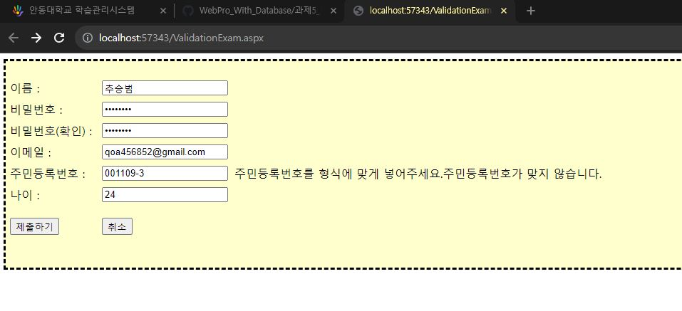
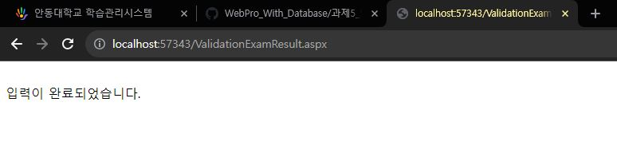

# 5-5
## 5-5 실습 유효성 검사 컨트롤
### 유효성에 맞지않게 입력됐을 때


### 유효성에 맞게 입력하여 제출하기를 눌렀을 때


## 코드
### 초기화면
```html
<%@ Page Language="C#" AutoEventWireup="true" CodeFile="ValidationExam.aspx.cs" Inherits="ValidationExam" %>


<html xmlns="http://www.w3.org/1999/xhtml">
<head runat="server">
    <title></title>
    <script type="text/javascript">
        function ValidateSocialNumber(source, args) {
            var sn = args.Value;
            var checkDigit = 0;
            var weight = 2;

            for (var i = 0; i < 13; i++) {
                if (i == 6) continue;

                checkDigit += parseInt(sn.charAt(i)) * weight;

                weight++;
                if (weight > 9) weight = 2;
            }

            checkDigit = (11 - (checkDigit % 11)) % 10;

            if (parseInt(sn.charAt(13)) == checkDigit)
                args.IsValid = true;
            else
                args.IsValid = false;
        }
    </script>
</head>
<body>
    <form id="form1" runat="server">
    <div>
    
<asp:Panel ID="pnlBorder" runat="server" BorderStyle="Dashed" Height="290px" BackColor="#FFFFCC"><br />
<asp:Table ID="tblFrame" runat="server" BorderStyle="None" CellPadding="3" CellSpacing="3">
<asp:TableRow runat="server">
<asp:TableCell runat="server" Width="120">
<asp:Label ID="lblName" runat="server" Text="이름 : "></asp:Label>
</asp:TableCell>
<asp:TableCell runat="server">
<asp:TextBox ID="txtName" runat="server"></asp:TextBox>
</asp:TableCell>
<asp:TableCell runat="server">
<asp:RequiredFieldValidator ID="vldNameRequired" runat="server" ErrorMessage="이름을 입력해주세요." ControlToValidate="txtName" SetFocusOnError="True" Display="Dynamic"></asp:RequiredFieldValidator>
</asp:TableCell>
</asp:TableRow>
<asp:TableRow runat="server">
<asp:TableCell runat="server">
<asp:Label ID="lblPassword" runat="server" Text="비밀번호 : "></asp:Label>
</asp:TableCell>
<asp:TableCell runat="server">
<asp:TextBox ID="txtPassword" runat="server" TextMode="Password"></asp:TextBox>
</asp:TableCell>
<asp:TableCell runat="server">
<asp:RequiredFieldValidator ID="vldPasswordRequired" runat="server" ErrorMessage="비밀번호를 입력해주세요." ControlToValidate="txtPassword" SetFocusOnError="True" Display="Dynamic"></asp:RequiredFieldValidator>
<asp:RegularExpressionValidator ID="vldPassword" runat="server" ErrorMessage="비밀번호는 4자 이상 10자 이하여야 합니다." ControlToValidate="txtPassword" ValidationExpression="\w{4,10}" SetFocusOnError="True" Display="Dynamic"></asp:RegularExpressionValidator>
</asp:TableCell>
</asp:TableRow>
<asp:TableRow runat="server">
<asp:TableCell runat="server">
<asp:Label ID="lblRetype" runat="server" Text="비밀번호(확인) : "></asp:Label>
</asp:TableCell>
<asp:TableCell runat="server">
<asp:TextBox ID="txtRetype" runat="server" TextMode="Password"></asp:TextBox>
</asp:TableCell>
<asp:TableCell runat="server">
<asp:RequiredFieldValidator ID="vldRetypeRequired" runat="server" ErrorMessage="비밀번호(확인)를 다시 입력해주세요." ControlToValidate="txtRetype" Display="Dynamic"></asp:RequiredFieldValidator>
<asp:CompareValidator ID="vldRetype" runat="server" ErrorMessage="비밀번호와 일치하지 않습니다." ControlToCompare="txtPassword" ControlToValidate="txtRetype" Display="Dynamic"></asp:CompareValidator>
</asp:TableCell>
</asp:TableRow>
<asp:TableRow runat="server">
<asp:TableCell runat="server">
<asp:Label ID="lblEMail" runat="server" Text="이메일 : "></asp:Label>
</asp:TableCell>
<asp:TableCell runat="server">
<asp:TextBox ID="txtEMail" runat="server"></asp:TextBox>
</asp:TableCell>
<asp:TableCell runat="server">
<asp:RequiredFieldValidator ID="vldEMailRequired" runat="server" ErrorMessage="이메일을 입력해주세요." ControlToValidate="txtEMail" Display="Dynamic"></asp:RequiredFieldValidator>
<asp:RegularExpressionValidator ID="vldEMail" runat="server" ErrorMessage="이메일 형식이 아닙니다." ControlToValidate="txtEMail" ValidationExpression="\S+@\S+\.\S+" Display="Dynamic"></asp:RegularExpressionValidator>
</asp:TableCell>
</asp:TableRow>
<asp:TableRow runat="server">
<asp:TableCell runat="server">
<asp:Label ID="lblSocialNumber" runat="server" Text="주민등록번호 : "></asp:Label>
</asp:TableCell>
<asp:TableCell runat="server">
<asp:TextBox ID="txtSocialNumber" runat="server"></asp:TextBox>
</asp:TableCell>
<asp:TableCell runat="server">
<asp:RequiredFieldValidator ID="vldSNRequired" runat="server" ErrorMessage="주민등록번호를 입력해주세요." ControlToValidate="txtSocialNumber" Display="Dynamic"></asp:RequiredFieldValidator>
<asp:RegularExpressionValidator ID="vldSNRegularExpression" runat="server" ErrorMessage="주민등록번호를 형식에 맞게 넣어주세요." SetFocusOnError="True" ValidationExpression="\d{6}-[1-4]\d{6}" ControlToValidate="txtSocialNumber" Display="Dynamic"></asp:RegularExpressionValidator>
<asp:CustomValidator ID="vldSocialNumber" runat="server" ErrorMessage="주민등록번호가 맞지 않습니다." OnServerValidate="vldSocialNumber_ServerValidate" ControlToValidate="txtSocialNumber" Display="Dynamic" SetFocusOnError="True" ClientValidationFunction="ValidateSocialNumber"></asp:CustomValidator>
</asp:TableCell>
</asp:TableRow>
<asp:TableRow runat="server">
<asp:TableCell runat="server">
<asp:Label ID="lblAge" runat="server" Text="나이 : "></asp:Label>
</asp:TableCell>
<asp:TableCell runat="server">
<asp:TextBox ID="txtAge" runat="server"></asp:TextBox>
</asp:TableCell>
<asp:TableCell runat="server">
<asp:RangeValidator ID="vldAge" runat="server" ErrorMessage="0 - 150 사이로 입력합니다." ControlToValidate="txtAge" Display="Dynamic" MaximumValue="150" MinimumValue="0" Type="Integer"></asp:RangeValidator>
</asp:TableCell>
</asp:TableRow>
<asp:TableRow runat="server">
<asp:TableCell runat="server" RowSpan="0" HorizontalAlign="Left" Height="50">
<asp:Button ID="btnSubmit" runat="server" Text="제출하기" OnClick="btnSubmit_Click"/></asp:TableCell>
<asp:TableCell runat="server" HorizontalAlign="Left">
<asp:Button ID="btnCancel" runat="server" Text="취소" OnClick="btnCancel_Click" CausesValidation="False" /></asp:TableCell>
<asp:TableCell runat="server">&nbsp;</asp:TableCell>
</asp:TableRow>
</asp:Table>
</asp:Panel>
        <asp:ValidationSummary ID="ValidationSummary1" runat="server" 
            ShowMessageBox="True" ShowSummary="False" />
    </div>
    </form>
</body>
</html>
```

```c#
using System;
using System.Collections.Generic;
using System.Linq;
using System.Web;
using System.Web.UI;
using System.Web.UI.WebControls;

public partial class ValidationExam : System.Web.UI.Page
{
    protected void Page_Load(object sender, EventArgs e)
    {
    }

    protected void btnCancel_Click(object sender, EventArgs e)
    {
        txtName.Text = "";
        txtPassword.Text = "";
        txtRetype.Text = "";
        txtEMail.Text = "";
        txtSocialNumber.Text = "";
        txtAge.Text = "";
    }

    protected void vldSocialNumber_ServerValidate(object sender, ServerValidateEventArgs e)
    {
        int checkDigit = 0;
        int weight = 2;

        for (int i = 0; i < 13; i++)
        {
            if (i == 6) continue;

            checkDigit += int.Parse(txtSocialNumber.Text.Substring(i, 1)) * weight;

            weight++;
            if (weight > 9) weight = 2;
        }
        checkDigit = (11 - (checkDigit % 11)) % 10;

        if (int.Parse(txtSocialNumber.Text.Substring(13, 1)) == checkDigit)
            e.IsValid = true;
        else
            e.IsValid = false;
    }

    protected void btnSubmit_Click(object sender, EventArgs e)
    {
        if (Page.IsValid == true) Response.Redirect("ValidationExamResult.aspx");
    }
}
```
### 결과화면
```html
<%@ Page Language="C#" AutoEventWireup="true" CodeFile="ValidationExamResult.aspx.cs" Inherits="ValidationExamResult" %>

<html xmlns="http://www.w3.org/1999/xhtml">
<head runat="server">
    <title></title>
</head>
<body>
    <form id="form1" runat="server">
    <div>
    
    </div>
    </form>
</body>
</html>
```

```c#
using System;
using System.Collections.Generic;
using System.Linq;
using System.Web;
using System.Web.UI;
using System.Web.UI.WebControls;

public partial class ValidationExamResult : System.Web.UI.Page
{
protected void Page_Load(object sender, EventArgs e)
{
    Response.Write("<br />입력이 완료되었습니다.");
}
}

```
