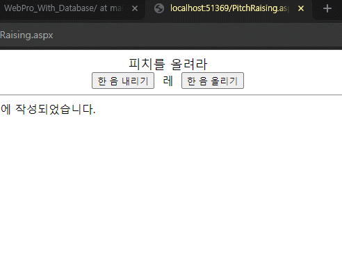
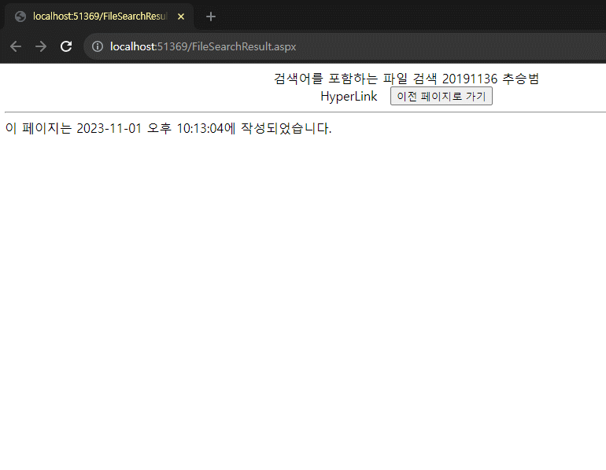
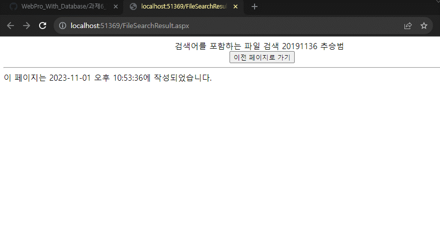

# 실습 6-1, 6-2, 6-3
## 6-1 뷰 상태 이용하기
## 코드와 실행화면
* html
```html
<%@ Page Language="C#" AutoEventWireup="true" CodeFile="PitchRaising.aspx.cs" Inherits="PitchRaising" %>

<!DOCTYPE html>

<html xmlns="http://www.w3.org/1999/xhtml">
<head runat="server">
<meta http-equiv="Content-Type" content="text/html; charset=utf-8"/>
    <title></title>
    <style type="text/css">
        .auto-style1 {
            text-align: center;
        }
    </style>
</head>
<body>
    <form id="form1" runat="server">
        <div class="auto-style1">
            <asp:Label ID="lblTitle" runat="server" Text="피치를 올려라" Font-Size="Large"></asp:Label>
            <br />
            <asp:Button ID="btnPitchDown" runat="server" Text="한 음 내리기" OnClick="btnPitchDown_Click" />
&nbsp;<asp:Label ID="lblPitch" runat="server" Text="라"></asp:Label>
&nbsp;<asp:Button ID="btnPitchUp" runat="server" Text="한 음 올리기" OnClick="btnPitchUp_Click" />
        </div>
    </form>
</body>
</html>
```
* c# 코드
```c#
using System;
using System.Collections.Generic;
using System.Linq;
using System.Web;
using System.Web.UI;
using System.Web.UI.WebControls;

public partial class PitchRaising : System.Web.UI.Page
{
    protected string[] PitchArray = { "도", "레", "미", "파", "솔", "라", "시" };
    protected int Note;
    protected void ShowPitch()
    {
        lblPitch.Text = PitchArray[Note];
    }
    protected void Page_Load(object sender, EventArgs e)
    {
        if (IsPostBack)
            Note = (int)ViewState["Note"];
        else
            Note = 5; // "시"
    }
    protected void Page_PreRender(object sender, EventArgs e)
    {
        ViewState["Note"] = Note;
    }
    protected void btnPitchDown_Click(object sender, EventArgs e)
    {
        Note = (int)ViewState["Note"] - 1;

        if (Note < 0)
            Note = 6;

        ShowPitch();
    }

    protected void btnPitchUp_Click(object sender, EventArgs e)
    {
        Note = ((int)ViewState["Note"] + 1) % 7;
        ShowPitch();
    }
}
```


## 6-2 페이지 간 게시 사용하기
## 코드와 실행화면
* 검색어 설정화면
* html
```html
<%@ Page Language="C#" AutoEventWireup="true" CodeFile="FileSearch.aspx.cs" Inherits="FileSearch" %>

<!DOCTYPE html>

<html xmlns="http://www.w3.org/1999/xhtml">
<head runat="server">
<meta http-equiv="Content-Type" content="text/html; charset=utf-8"/>
    <title></title>
</head>
<body>
    <form id="form1" runat="server">
        <div style="text-align: center">
            검색어를 포함하는 파일 검색 20191136 추승범<br />
            검색어 :
            <asp:TextBox ID="txtKeyWord" runat="server"></asp:TextBox>
            <br />
            파일형 :
            <asp:DropDownList ID="ddlFileType" runat="server">
                <asp:ListItem Value="0">워드(*.doc)</asp:ListItem>
                <asp:ListItem Value="1">파워포인트(*.ppt)</asp:ListItem>
                <asp:ListItem Value="2">한글(*.hwp)</asp:ListItem>
                <asp:ListItem Value="3">어도비(*.pdf)</asp:ListItem>
            </asp:DropDownList>
            <br />
            <asp:Button ID="btnSearch" runat="server" Text="검색어 보기"  PostBackUrl="~/FileSearchResult.aspx" />
        </div>
    </form>
</body>
</html>

```

* 검색어 결과화면
* html
```html
<%@ Page Language="C#" AutoEventWireup="true" CodeFile="FileSearchResult.aspx.cs" Inherits="FileSearchResult" %>

<!DOCTYPE html>

<html xmlns="http://www.w3.org/1999/xhtml">
<head runat="server">
<meta http-equiv="Content-Type" content="text/html; charset=utf-8"/>
    <title></title>
</head>
<body>
    <form id="form1" runat="server">
        <div style="text-align: center">
            검색어를 포함하는 파일 검색 20191136 추승범<br />
            <asp:HyperLink ID="InkSearchString" Target="_blank" runat="server">HyperLink</asp:HyperLink>
&nbsp;
            <asp:Button ID="btnGoBack" PostBackUrl="~/FileSearch.aspx" runat="server" Text="이전 페이지로 가기" />
        </div>
    </form>
</body>
</html>
```
* c# 코드
```c#
using System;
using System.Collections.Generic;
using System.Linq;
using System.Web;
using System.Web.UI;
using System.Web.UI.WebControls;

public partial class FileSearchResult : System.Web.UI.Page
{
    protected void Page_Load(object sender, EventArgs e)
    {
        if(PreviousPage != null)
        {
            TextBox txtKeyWord;
            txtKeyWord = (TextBox)PreviousPage.FindControl("txtKeyWord");
            DropDownList ddlFileType;
            ddlFileType = (DropDownList)PreviousPage.FindControl("ddlFileType");

            string url = "http://www.google.co.kr/search?q=";
            url += Server.UrlEncode(txtKeyWord.Text + " ");

            string fileType = "";
            switch (ddlFileType.SelectedIndex)
            {
                case 0:
                    fileType = "filetype:doc";
                    break;
                case 1:
                    fileType = "filetype:ppt";
                    break;
                case 2:
                    fileType = "fi;etype:hwp";
                    break;
                case 3:
                    fileType = "filetype:pdf";
                    break;
            }
            url += fileType;

            InkSearchString.NavigateUrl = url;
            InkSearchString.Text = txtKeyWord.Text + " " + fileType;
        }
    }
}
```


## 6-3 쿼리 스트링 사용하기
## 코드와 실행화면
* 검색어 설정화면
* html
```html
<%@ Page Language="C#" AutoEventWireup="true" CodeFile="FileSearch.aspx.cs" Inherits="FileSearch" %>

<!DOCTYPE html>

<html xmlns="http://www.w3.org/1999/xhtml">
<head runat="server">
<meta http-equiv="Content-Type" content="text/html; charset=utf-8"/>
    <title></title>
</head>
<body>
    <form id="form1" runat="server">
        <div style="text-align: center">
            검색어를 포함하는 파일 검색 20191136 추승범<br />
            검색어 :
            <asp:TextBox ID="txtKeyWord" runat="server"></asp:TextBox>
            <br />
            파일형 :
            <asp:DropDownList ID="ddlFileType" runat="server">
                <asp:ListItem Value="0">워드(*.doc)</asp:ListItem>
                <asp:ListItem Value="1">파워포인트(*.ppt)</asp:ListItem>
                <asp:ListItem Value="2">한글(*.hwp)</asp:ListItem>
                <asp:ListItem Value="3">어도비(*.pdf)</asp:ListItem>
            </asp:DropDownList>
            <br />
            <asp:Button ID="btnSearch" runat="server" Text="검색어 보기" OnClick="btnSearch_Click" />
        </div>
    </form>
</body>
</html>
```
* c# 코드
```c#
using System;
using System.Collections.Generic;
using System.Linq;
using System.Web;
using System.Web.UI;
using System.Web.UI.WebControls;

public partial class FileSearch : System.Web.UI.Page
{
    protected void Page_Load(object sender, EventArgs e){}
    public string KeyWord
    {
        get { return txtKeyWord.Text; }
    }

    public string FileType
    {
        get
        {
            string returnValue = "";
            switch (ddlFileType.SelectedIndex)
            {
                case 0:
                    returnValue = "filetype:doc";
                    break;
                case 1:
                    returnValue = "filetype:ppt";
                    break;
                case 2:
                    returnValue = "filetype:hwp";
                    break;
                case 3:
                    returnValue = "filetype:pdf";
                    break;
            }
            return returnValue;
        }
    }

    protected void btnSearch_Click(object sender, EventArgs e)
    {
        string queryString = "KeyWord=" + Server.UrlEncode(txtKeyWord.Text);
        queryString += "&";
        queryString += "FileType=" + this.FileType;
        Response.Redirect("FileSearchResult.aspx?" + queryString);
    }
}
```
* 검색 결과화면
* html
```html
<%@ Page Language="C#" AutoEventWireup="true" CodeFile="FileSearchResult.aspx.cs" Inherits="FileSearchResult" %>

<!DOCTYPE html>

<html xmlns="http://www.w3.org/1999/xhtml">
<head runat="server">
<meta http-equiv="Content-Type" content="text/html; charset=utf-8"/>
    <title></title>
</head>
<body>
    <form id="form1" runat="server">
        <div style="text-align: center">
            검색어를 포함하는 파일 검색 20191136 추승범<br />
            <asp:HyperLink ID="lnkSearchString" Target="_blank" runat="server">HyperLink</asp:HyperLink>
&nbsp;
            <asp:Button ID="btnGoBack" PostBackUrl="~/FileSearch.aspx" runat="server" Text="이전 페이지로 가기" />
        </div>
    </form>
</body>
</html>

```
* c# 코드
```c#
using System;
using System.Collections.Generic;
using System.Linq;
using System.Security.Policy;
using System.Web;
using System.Web.UI;
using System.Web.UI.WebControls;

public partial class FileSearchResult : System.Web.UI.Page
{
    protected void Page_Load(object sender, EventArgs e)
    {
        lnkSearchString.Text = Request.QueryString["KeyWord"] + " ";
        lnkSearchString.Text += Request.QueryString["FileType"];
        string url = "http://www.google.co.kr/search?q=";
        url += Server.UrlEncode(lnkSearchString.Text);
        lnkSearchString.NavigateUrl = url;
    }
}
```


