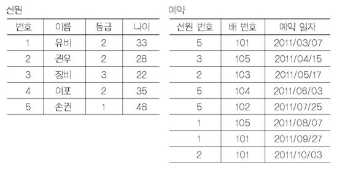
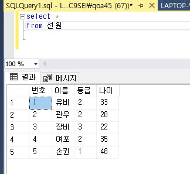
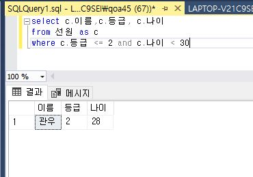
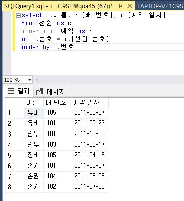
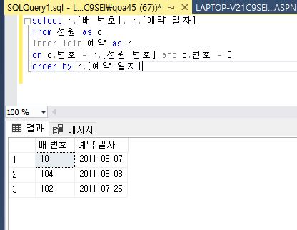
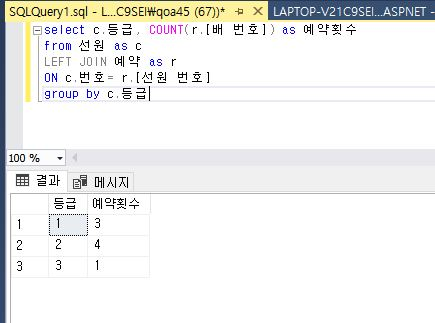

# 7장 연습문제 4번
## 4. 주어진 두 테이블의 데이터를 이용하여 다음 질의를 SQL문으로 작성하여라.\

### 1. 모든 선원의 모든 정보를 검색하여라.

### 2. 등급이 2급 이상(1~2급)이고, 나이가 30세 미만인 선원의 이름과 등급, 그리고 나이를 검색하여라

### 3. 배를 예약한 모든 선원의 이름과 배 번호, 예약 일자를 검색하여라.

### 4. 선원 '손권'이 예약한 배 번호와 예약 일자를 검색하여라.

### 5. 선원 등급별로 배를 예약한 횟수를 구하여라.


---
---
---
## 전체 쿼리문
```
준비 - 데이터 넣기
/*insert 선원
values
(1,'유비',2,33)
,(2,'관우',2,28)
,(3,'장비',3,22)
,(4,'여포',2,35)
,(5,'손권',1,48)

/*insert 예약
values
(5,101,'2011/03/07')
,(3, 105,'2011/04/15')
,(2,103,'2011/05/17')
,(5,104,'2011/06/03')
,(5,102,'2011/07/25')
,(1,105,'2011/08/07')
,(1,101,'2011/09/27')
,(2,101,'2011/10/03')*/

1. 모든 선원의 모든 정보를 검색하여라.

// 예약이 있는 사람만
select c.번호,c.이름,c.등급, c.나이, r.[예약 일자]
from 선원 as c
inner join 예약 as r
on c.번호 = r.[선원 번호]
order by r.[예약 일자]

// 예약이 없는 경우도 출력
/*select c.번호,c.이름,c.등급, c.나이, r.[예약 일자]
from 선원 as c
left join 예약 as r
on c.번호 = r.[선원 번호]
order by r.[예약 일자]*/

// 모든 선원
/*select *
from 선원*/


2. 등급이 2급 이상(1~2급)이고, 나이가 30세 미만인 선원의 이름과 등급, 그리고 나이를 검색하여라.

select c.이름,c.등급, c.나이
from 선원 as c
where c.등급 <= 2 and c.나이 < 30


3. 배를 예약한 모든 선원의 이름과 배 번호, 예약 일자를 검색하여라.

select c.이름, r.[배 번호], r.[예약 일자]
from 선원 as c
inner join 예약 as r
on c.번호 = r.[선원 번호]
order by r.[예약 일자]


4. 선원 '손권'이 예약한 배 번호와 예약 일자를 검색하여라.

select r.[배 번호], r.[예약 일자]
from 선원 as c
inner join 예약 as r
on c.번호 = r.[선원 번호] and c.번호 = 5
order by r.[예약 일자]


5. 선원 등급별로 배를 예약한 횟수를 구하여라.

select c.등급, COUNT(r.[배 번호]) as 예약횟수
from 선원 as c
LEFT JOIN 예약 as r
ON c.번호= r.[선원 번호]
group by c.등급;

```
