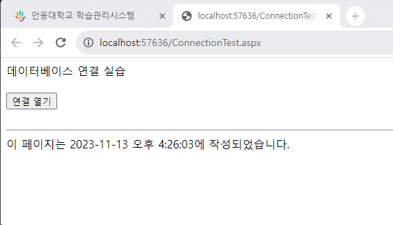

# App과 DB연동 실습


## 코드
```html
<%@ Page Language="C#" AutoEventWireup="true" CodeFile="ConnectionTest.aspx.cs" Inherits="ConnectionTest" %>

<!DOCTYPE html>

<html xmlns="http://www.w3.org/1999/xhtml">
<head runat="server">
<meta http-equiv="Content-Type" content="text/html; charset=utf-8"/>
    <title></title>
</head>
<body>
    <form id="form1" runat="server">
        <div>
            데이터베이스 연결 실습<br />
            <br />
            <asp:Button ID="btnConnection" onClick="btnConnection_Click" runat="server" Text="연결 열기" />
            <br />
            <br />
            <asp:Label ID="lblConnectionInformation" runat="server"></asp:Label>
        </div>
    </form>
</body>
</html>
```

```c#
using System;
using System.Collections.Generic;
using System.Data.SqlClient;
using System.Linq;
using System.Web;
using System.Web.Configuration;
using System.Web.UI;
using System.Web.UI.WebControls;
using System.Data;

public partial class ConnectionTest : System.Web.UI.Page
{
    protected void Page_Load(object sender, EventArgs e)
    {

    }

    protected void btnConnection_Click(object sender, EventArgs e)
    {
        string connectionString =
                WebConfigurationManager.ConnectionStrings["AdventureWorks2"].ConnectionString;
        SqlConnection conn = new SqlConnection(connectionString);

        lblConnectionInformation.Text = "<font color='red'>";

        try
        {
            conn.Open();
            lblConnectionInformation.Text += "<b>서버 버전 : </b>" + conn.ServerVersion;
            lblConnectionInformation.Text += "<br /><b>연결 상태 : </b>" + conn.State.ToString();
        }
        catch (Exception error)
        {
            lblConnectionInformation.Text += "<b>데이터베이스 읽기 오류</b><br />";
            lblConnectionInformation.Text += error.Message;
        }
        finally
        {
            conn.Close();
            lblConnectionInformation.Text += "<br /><b>마지막 연결 상태 : </b>" + conn.State.ToString();
        }

        lblConnectionInformation.Text += "</font>";
    }
}
```
