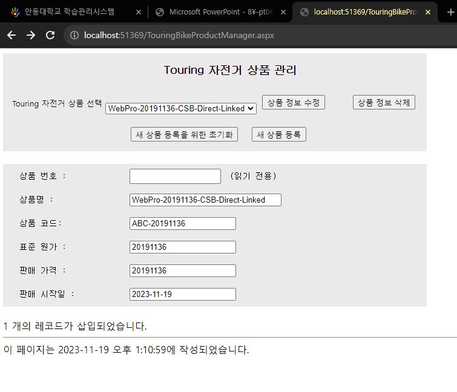
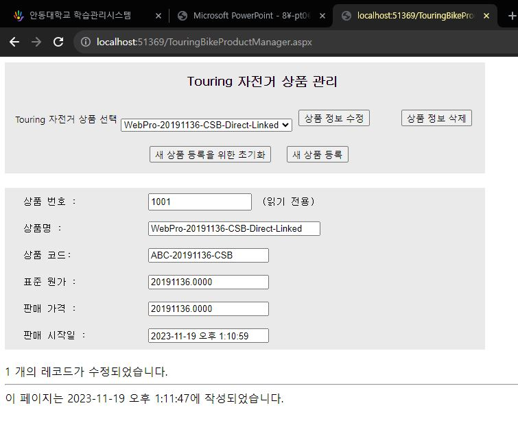
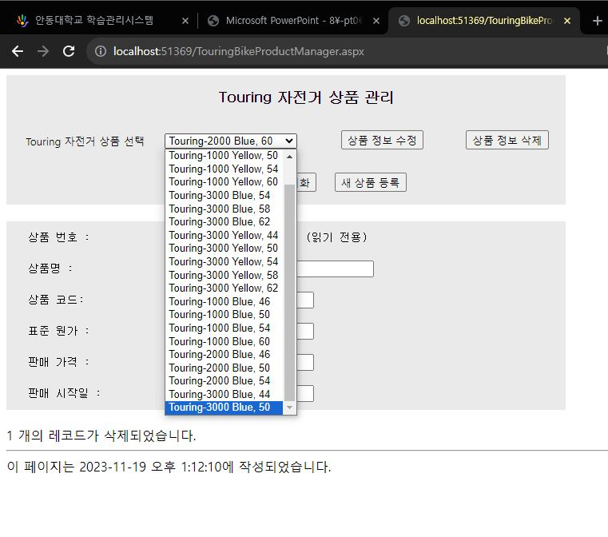
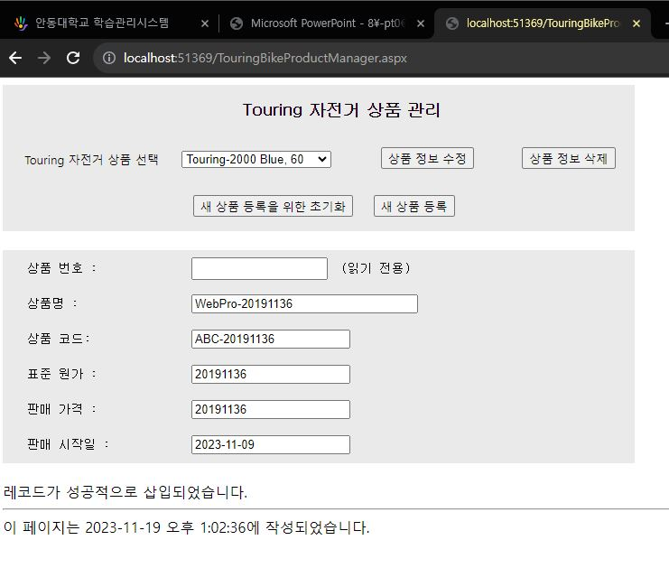
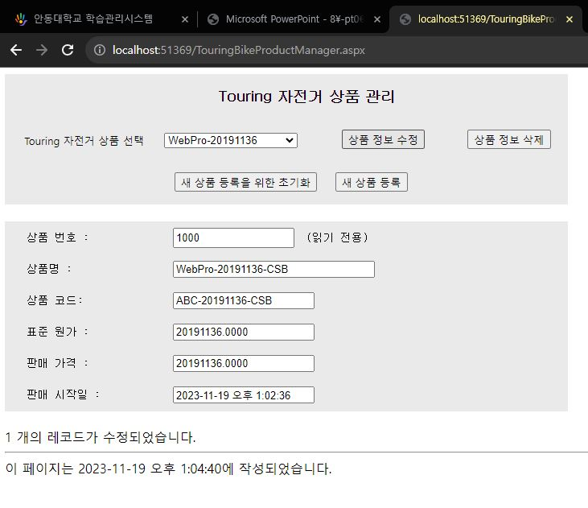
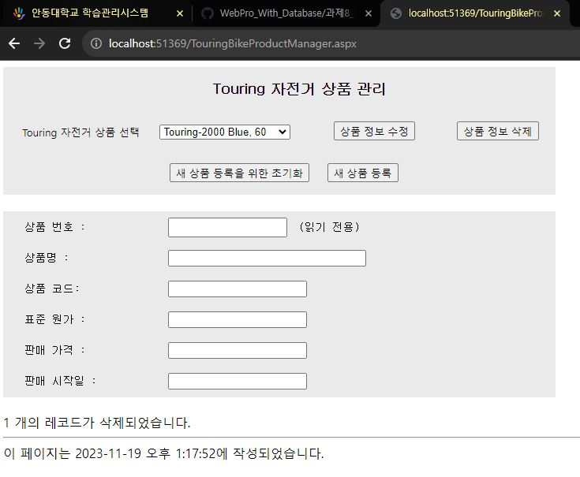

# 실습 8-2 직접 데이터 접근/비연결 기반 데이터 접근
## 실행 화면
### 직접 데이터 접근





---

### 비연결 기반 데이터 접근






---
---
---

### 코드

```html
<%@ Page Language="C#" AutoEventWireup="true" CodeFile="TouringBikeProductManager.aspx.cs" Inherits="TouringBikeProductManager" %>

<!DOCTYPE html PUBLIC "-//W3C//DTD XHTML 1.0 Transitional//EN" "http://www.w3.org/TR/xhtml1/DTD/xhtml1-transitional.dtd">

<html xmlns="http://www.w3.org/1999/xhtml">
<head runat="server">
    <title></title>
    <style type="text/css">
        .style1
        {
            font-size: small;
        }
        .style2
        {
            font-family: 굴림, Arial, san-serif;
        }
    </style>
</head>
<body>
    <form id="form1" runat="server">
    <div>
    
        <div style="background-color: #EAEAEA; width: 700px;">
            <table style="width: 700px;">
                <tr>
                    <td colspan="4" 
                        
                        
                        style="font-family: 바탕, 'Times New Roman', serif; font-size: large; text-align: center; font-weight: bold; height: 50px;">
                        &nbsp;
                        &nbsp;
                        &nbsp;
                        <span class="style2">Touring 자전거 상품 관리</span></td>
                </tr>
                <tr style="height: 50px">
                    <td style="width: 180px; text-align: center;">
                        &nbsp;
                        <span class="style1">Touring 자전거 상품 선택</span></td>
                    <td>
                        &nbsp;
                        <asp:DropDownList ID="ddlProducts" runat="server" AutoPostBack="True" 
                            onselectedindexchanged="ddlProducts_SelectedIndexChanged">
                        </asp:DropDownList>
                    </td>
                    <td style="width: 140px">
                        &nbsp;<asp:Button ID="btnUpdate" runat="server" Text="상품 정보 수정" 
                            onclick="btnUpdate_Click" />
                    </td>
                    <td style="width: 140px; text-align: center;">
                        <asp:Button ID="btnDelete" runat="server" Text="상품 정보 삭제" 
                            onclick="btnDelete_Click" />
                    </td>
                </tr>
                <tr>
                    <td colspan="4" style="text-align: center; height: 50px;">
                        &nbsp;
                        &nbsp;
                        <asp:Button ID="btnClearInformation" runat="server" 
                            Text="새 상품 등록을 위한 초기화" onclick="btnClearInformation_Click" />
&nbsp;&nbsp;
                        <asp:Button ID="btnInsertNewProduct" runat="server" Text="새 상품 등록" 
                            onclick="btnInsertNewProduct_Click" />
                        &nbsp;</td>
                </tr>
            </table>
        </div><br/>
        <div style="width: 700px; background-color: #EAEAEA;">
            <table style="width: 700px; font-family: 굴림체, 'Courier New', monospace; font-size: medium; height: 50px;">
                <tr>
                    <td style="height: 25px" >
                                                &nbsp;</td>
                    <td style="height: 35px" class="style1" >
                                                상품 번호 :</td>
                    <td>
                        <asp:TextBox ID="txtProductID" runat="server" ReadOnly="True" Width="143px" 
                            Height="19px" CssClass="style1"></asp:TextBox>
                        <span class="style1">&nbsp;(읽기 전용)</span></td>
                </tr>
                <tr>
                    <td style="width: 20px; height: 25px;">
                        &nbsp;</td>
                    <td style="height: 35px;" class="style1">
                        상품명 :</td>
                    <td>
                        <asp:TextBox ID="txtProductName" runat="server" Width="243px" CssClass="style1"></asp:TextBox>
                    </td>
                </tr>
                <tr>
                    <td style="height: 25px">
                        &nbsp;</td>
                    <td style="height: 35px" class="style1">
                        상품 코드:</td>
                    <td>
                        <asp:TextBox ID="txtProductNumber" runat="server" CssClass="style1"></asp:TextBox>
                    </td>
                </tr>
                <tr>
                    <td style="height: 25px">
                        &nbsp;</td>
                    <td style="height: 35px" class="style1">
                        표준 원가 :</td>
                    <td>
                        <asp:TextBox ID="txtStandardCost" runat="server" CssClass="style1"></asp:TextBox>
                    </td>
                </tr>
                <tr>
                    <td style="height: 25px">
                        &nbsp;</td>
                    <td style="height: 35px" class="style1">
                        판매 가격 :</td>
                    <td>
                        <asp:TextBox ID="txtListPrice" runat="server" CssClass="style1"></asp:TextBox>
                    </td>
                </tr>
                <tr>
                    <td style="height: 25px">
                        &nbsp;</td>
                    <td style="height: 35px" class="style1">
                        판매 시작일 :</td>
                    <td>
                        <asp:TextBox ID="txtSellStartDate" runat="server" CssClass="style1"></asp:TextBox>
                    </td>
                </tr>
            </table>
        </div><br/>
        <asp:Label ID="lblStatus" runat="server"></asp:Label>
    </div>
    </form>
</body>
</html>

```
---

```c#
using System;
using System.Collections.Generic;
using System.Linq;
using System.Web;
using System.Web.UI;
using System.Web.UI.WebControls;
using System.Data;
using System.Data.SqlClient;
using System.Web.Configuration;

public partial class TouringBikeProductManager : System.Web.UI.Page
{
    private string connectionString = WebConfigurationManager.ConnectionStrings["AdventureWorks2"].ConnectionString;

    protected void Page_Load(object sender, EventArgs e)
    {
        if (!this.IsPostBack)
        {
            FillAllProductList();
        }
    }

    private void FillAllProductList()
    {
        
        ddlProducts.Items.Clear();

        string selectSQL = "SELECT name, productid FROM saleslt.product WHERE productcategoryid=7";
        SqlConnection conn = new SqlConnection(connectionString);
        SqlCommand cmd = new SqlCommand(selectSQL, conn);
        SqlDataReader rd;

        try
        {
            conn.Open();
            rd = cmd.ExecuteReader();

            while (rd.Read())
            {
                ListItem item = new ListItem();
                item.Text = rd["Name"].ToString();
                item.Value = rd["ProductID"].ToString();
                ddlProducts.Items.Add(item);
            }

            rd.Close();
        }
        catch (Exception error)
        {
            lblStatus.Text = "데이터베이스를 읽는 동안 오류가 발생했습니다.<br />";
            lblStatus.Text += error.Message;
        }
        finally
        {
            conn.Close();
        }
        
        /*
        ddlProducts.Items.Clear();

        string selectSQL = "SELECT name, productid FROM saleslt.product WHERE productcategoryid=7";
        SqlConnection conn = new SqlConnection(connectionString);
        SqlCommand cmd = new SqlCommand(selectSQL, conn);
        SqlDataAdapter da = new SqlDataAdapter(cmd);
        DataSet ds = new DataSet();

        try
        {
            da.Fill(ds, "TouringBike");

            DataRow row;
            for (int i = 0; i < ds.Tables["TouringBike"].Rows.Count; i++)
            {
                row = ds.Tables["TouringBike"].Rows[i];

                ListItem item = new ListItem();
                item.Text = row["Name"].ToString();
                item.Value = row["ProductID"].ToString();
                ddlProducts.Items.Add(item);
            }*/

        //DataRow row = ds.Tables["TouringBike"].Rows[0];
        /*foreach (DataRow row in ds.Tables["TouringBike"].Rows)
        {
            ListItem item = new ListItem();
            string name = (string)row["Name"];
            item.Text = row["Name"].ToString();
            item.Value = row["ProductID"].ToString();
            ddlProducts.Items.Add(item);
        }*/
        /*}
        catch (Exception error)
        {
            lblStatus.Text = "데이터베이스를 읽는 동안 오류가 발생했습니다.<br />";
            lblStatus.Text += error.Message;
        }
        finally
        {
            conn.Close();
        }*/
    }

    protected void btnUpdate_Click(object sender, EventArgs e)
    {
        // 직접 데이터 접근 방식 코드
        string updateSQL = "UPDATE saleslt.product SET Name=@pname, ";
        updateSQL += "ProductNumber=@pnum, StandardCost=@sc, ";
        updateSQL += "ListPrice=@lp, SellStartDate=@ssd WHERE productid=@pid";

        SqlConnection conn = new SqlConnection(connectionString);
        SqlCommand cmd = new SqlCommand(updateSQL, conn);

        cmd.Parameters.AddWithValue("@pname", txtProductName.Text);
        cmd.Parameters.AddWithValue("@pnum", txtProductNumber.Text);
        cmd.Parameters.AddWithValue("@sc", double.Parse(txtStandardCost.Text));
        cmd.Parameters.AddWithValue("@lp", double.Parse(txtListPrice.Text));
        cmd.Parameters.AddWithValue("@ssd", DateTime.Parse(txtSellStartDate.Text));
        cmd.Parameters.AddWithValue("@pid", txtProductID.Text);

        int updated = 0;

        try
        {
            conn.Open();
            updated = cmd.ExecuteNonQuery();
            lblStatus.Text = updated.ToString() + " 개의 레코드가 수정되었습니다.";
        }
        catch (Exception error)
        {
            lblStatus.Text = "데이터베이스에 쓰는 동안 오류가 발생했습니다.<br />";
            lblStatus.Text += error.Message;
        }
        finally
        {
            conn.Close();
        }
        

        // 비연결기반 데이터 접근 방식 코드
        /*
        SqlConnection conn = new SqlConnection(connectionString);
        SqlDataAdapter da = new SqlDataAdapter();

        string selectSQL = "SELECT * FROM saleslt.product WHERE productid=@pid";
        SqlCommand cmdSelect = new SqlCommand(selectSQL, conn);
        cmdSelect.Parameters.AddWithValue("@pid", txtProductID.Text);
        da.SelectCommand = cmdSelect;

        string updateSQL = "UPDATE saleslt.product SET Name=@pname, ";
        updateSQL += "ProductNumber=@pnum, StandardCost=@sc, ";
        updateSQL += "ListPrice=@lp, SellStartDate=@ssd WHERE productid=@pid";
        SqlCommand cmdUpdate = new SqlCommand(updateSQL, conn);
        cmdUpdate.Parameters.AddWithValue("@pname", txtProductName.Text);
        cmdUpdate.Parameters.AddWithValue("@pnum", txtProductNumber.Text);
        cmdUpdate.Parameters.AddWithValue("@sc", double.Parse(txtStandardCost.Text));
        cmdUpdate.Parameters.AddWithValue("@lp", double.Parse(txtListPrice.Text));
        cmdUpdate.Parameters.AddWithValue("@ssd", DateTime.Parse(txtSellStartDate.Text));
        cmdUpdate.Parameters.AddWithValue("@pid", txtProductID.Text);
        da.UpdateCommand = cmdUpdate;

        DataSet ds = new DataSet();

        try
        {
            da.Fill(ds, "TouringBike");

            DataTable table = ds.Tables["TouringBike"];
            DataRow[] rows = table.Select("productid=" + txtProductID.Text);
            for (int i = 0; i < rows.Length; i++)
            {
                rows[i]["Name"] = txtProductName.Text;
                rows[i]["ProductNumber"] = txtProductNumber.Text;
                rows[i]["StandardCost"] = double.Parse(txtStandardCost.Text);
                rows[i]["ListPrice"] = double.Parse(txtListPrice.Text);
                rows[i]["SellStartDate"] = DateTime.Parse(txtSellStartDate.Text);

                da.Update(ds, "TouringBike");
            }

            lblStatus.Text = rows.Length.ToString() + " 개의 레코드가 수정되었습니다.";
        }
        catch (Exception error)
        {
            lblStatus.Text = "데이터베이스에 쓰는 동안 오류가 발생했습니다.<br />";
            lblStatus.Text += error.Message;
        }*/
    }

    protected void ddlProducts_SelectedIndexChanged(object sender, EventArgs e)
    {
        lblStatus.Text = "";

        string selectSQL = "SELECT * FROM saleslt.product WHERE productid=@productid";
        SqlConnection conn = new SqlConnection(connectionString);
        SqlCommand cmd = new SqlCommand(selectSQL, conn);
        cmd.Parameters.AddWithValue("@productid", ddlProducts.SelectedValue);
        SqlDataReader rd;

        try
        {
            conn.Open();
            rd = cmd.ExecuteReader();
            rd.Read();

            txtProductID.Text = rd["ProductID"].ToString();
            txtProductName.Text = rd["Name"].ToString();
            txtProductNumber.Text = rd["ProductNumber"].ToString();
            txtStandardCost.Text = rd["StandardCost"].ToString();
            txtListPrice.Text = rd["ListPrice"].ToString();
            txtSellStartDate.Text = rd["SellStartDate"].ToString();

            rd.Close();
        }
        catch (Exception error)
        {
            lblStatus.Text = "데이터베이스를 읽는 동안 오류가 발생했습니다.<br />";
            lblStatus.Text += error.Message;
        }
        finally
        {
            conn.Close();
        }
    }

    protected void btnDelete_Click(object sender, EventArgs e)
    {
         //직접 데이터 접근 방식 코드
        string updateSQL = "DELETE FROM saleslt.product ";
        updateSQL += "WHERE productid=@pid";

        SqlConnection conn = new SqlConnection(connectionString);
        SqlCommand cmd = new SqlCommand(updateSQL, conn);

        cmd.Parameters.AddWithValue("@pid", txtProductID.Text);

        int deleted = 0;

        try
        {
            conn.Open();
            deleted = cmd.ExecuteNonQuery();
            lblStatus.Text = deleted.ToString() + " 개의 레코드가 삭제되었습니다.";

            txtProductID.Text = "";
            txtProductName.Text = "";
            txtProductNumber.Text = "";
            txtStandardCost.Text = "";
            txtListPrice.Text = "";
            txtSellStartDate.Text = "";
        }
        catch (Exception error)
        {
            lblStatus.Text = "데이터를 삭제하는 동안 오류가 발생했습니다.<br />";
            lblStatus.Text += error.Message;
        }
        finally
        {
            conn.Close();
        }

        if (deleted > 0)
        {
            FillAllProductList();
        }
        

        // 비연결기반 데이터 접근 방식 코드
        /*
        SqlConnection conn = new SqlConnection(connectionString);
        SqlDataAdapter da = new SqlDataAdapter();

        string selectSQL = "SELECT * FROM saleslt.product WHERE productid=@pid";
        SqlCommand cmdSelect = new SqlCommand(selectSQL, conn);
        cmdSelect.Parameters.AddWithValue("@pid", txtProductID.Text);
        da.SelectCommand = cmdSelect;

        string updateSQL = "DELETE FROM saleslt.product ";
        updateSQL += "WHERE productid=@pid";
        SqlCommand cmdDelete = new SqlCommand(updateSQL, conn);
        cmdDelete.Parameters.AddWithValue("@pid", txtProductID.Text);
        da.DeleteCommand = cmdDelete;

        DataSet ds = new DataSet();

        try
        {
            da.Fill(ds, "TouringBike");

            DataTable table = ds.Tables["TouringBike"];
            DataRow[] rows = table.Select("productid=" + txtProductID.Text);
            for (int i = 0; i < rows.Length; i++)
            {
                rows[i].Delete();

                da.Update(ds, "TouringBike");
            }

            lblStatus.Text = rows.Length.ToString() + " 개의 레코드가 수정되었습니다.";

            txtProductID.Text = "";
            txtProductName.Text = "";
            txtProductNumber.Text = "";
            txtStandardCost.Text = "";
            txtListPrice.Text = "";
            txtSellStartDate.Text = "";

            FillAllProductList();
        }
        catch (Exception error)
        {
            lblStatus.Text = "데이터를 삭제하는 동안 오류가 발생했습니다.<br />";
            lblStatus.Text += error.Message;
        }*/
    }

    protected void btnInsertNewProduct_Click(object sender, EventArgs e)
    {
        //직접 데이터 접근 방식 코드

        string insertSQL = "INSERT INTO saleslt.product";
        insertSQL += "(name, productnumber, standardcost, listprice, ";
        insertSQL += "productcategoryid, sellstartdate) VALUES ";
        insertSQL += "(@pname, @pnum, @sc, @lp, 7, GETDATE())";

        SqlConnection conn = new SqlConnection(connectionString);
        SqlCommand cmd = new SqlCommand(insertSQL, conn);

        cmd.Parameters.AddWithValue("@pname", txtProductName.Text);
        cmd.Parameters.AddWithValue("@pnum", txtProductNumber.Text);
        cmd.Parameters.AddWithValue("@sc", double.Parse(txtStandardCost.Text));
        cmd.Parameters.AddWithValue("@lp", double.Parse(txtListPrice.Text));

        int inserted = 0;

        try
        {
            conn.Open();
            inserted = cmd.ExecuteNonQuery();
            lblStatus.Text = inserted.ToString() + " 개의 레코드가 삽입되었습니다.";
        }
        catch (Exception error)
        {
            lblStatus.Text = "데이터베이스에 쓰는 동안 오류가 발생했습니다.<br />";
            lblStatus.Text += error.Message;
        }
        finally
        {
            conn.Close();
        }

        if (inserted > 0)
        {
            FillAllProductList();
        }
        

        // 비연결기반 데이터 접근 방식 코드
        /*
        SqlConnection conn = new SqlConnection(connectionString);
        SqlDataAdapter da = new SqlDataAdapter();

        string selectSQL = "SELECT * FROM saleslt.product WHERE productid=@pid";
        SqlCommand cmdSelect = new SqlCommand(selectSQL, conn);
        cmdSelect.Parameters.AddWithValue("@pid", txtProductID.Text);
        da.SelectCommand = cmdSelect;

        string insertSQL = "INSERT INTO saleslt.product";
        insertSQL += "(name, productnumber, standardcost, listprice, ";
        insertSQL += "productcategoryid, sellstartdate) VALUES ";
        insertSQL += "(@pname, @pnum, @sc, @lp, 7, GETDATE())";
        SqlCommand cmdInsert = new SqlCommand(insertSQL, conn);
        cmdInsert.Parameters.AddWithValue("@pname", txtProductName.Text);
        cmdInsert.Parameters.AddWithValue("@pnum", txtProductNumber.Text);
        cmdInsert.Parameters.AddWithValue("@sc", double.Parse(txtStandardCost.Text));
        cmdInsert.Parameters.AddWithValue("@lp", double.Parse(txtListPrice.Text));
        da.InsertCommand = cmdInsert;

        DataSet ds = new DataSet();

        try
        {
            da.Fill(ds, "TouringBike");
            DataTable table = ds.Tables["TouringBike"];
            DataRow row = table.NewRow();
            row["Name"] = txtProductName.Text;
            row["ProductNumber"] = txtProductNumber.Text;
            row["StandardCost"] = double.Parse(txtStandardCost.Text);
            row["ListPrice"] = double.Parse(txtListPrice.Text);
            table.Rows.Add(row);

            da.Update(ds, "TouringBike");

            lblStatus.Text = "레코드가 성공적으로 삽입되었습니다.";

            FillAllProductList();
        }
        catch (Exception error)
        {
            lblStatus.Text = "데이터베이스에 쓰는 동안 오류가 발생했습니다.<br />";
            lblStatus.Text += error.Message;
        }*/
    }

    protected void btnClearInformation_Click(object sender, EventArgs e)
    {
        txtProductID.Text = "";
        txtProductName.Text = "";
        txtProductNumber.Text = "";
        txtStandardCost.Text = "";
        txtListPrice.Text = "";
        txtSellStartDate.Text = "";

        lblStatus.Text = "제품 정보를 모두 입력한 후 <새 상품 등록> 버튼을 클릭하세요.";
    }
}


```

